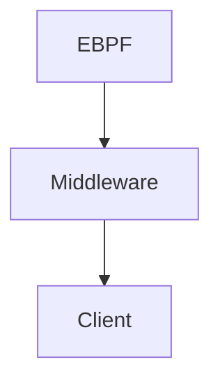

Data:
- Flows: Flows are captured by EBPF. The middleware get these flows and store them in `flow.csv`.
- Configuration: The configuration `config.json` is modified by the client. The middleware send the configuration inside of this file to the EBPF:. 

The `flows.csv` has the following data:
- Flow is active
- Flow identifier (MD5 hash of the flow)
- Source IP
- Destination IP
- Transport Protocol
- Source Port
- Destination Port
- Bytes per second
- Total bytes
```csv
1, df93ac733e9309ca99a77643f5aed198, 192.168.0.1, 192.168.0.2, TCP, 2000, 3000, 10000, 92928391
```

The `config.json` has the following data:
- Blocked flows

```ini
{
    "blocked-flows": [
        "df93ac733e9309ca99a77643f5aed198"
    ]
}
````
